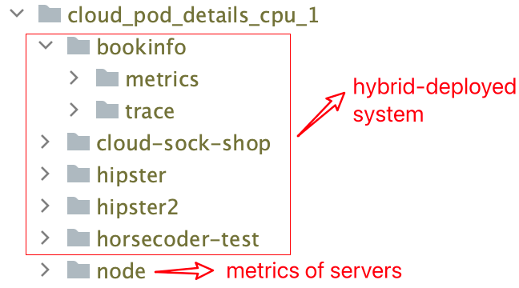
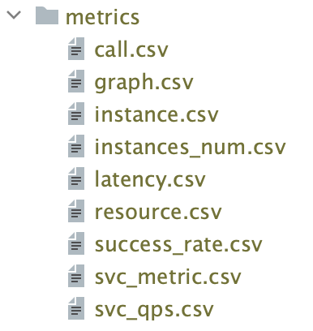
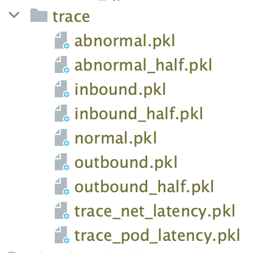
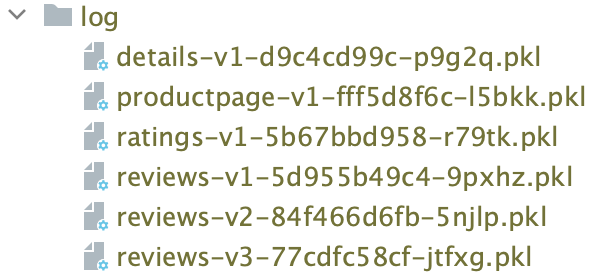

# MicroCERCL

[中文文档](README_zh.md)

## Description

**MicroCERCL** extracts valid contents from kernel-level logs to prioritize localizing the kernel-level root cause. Moreover, **MicroCERCL** constructs a heterogeneous dynamic topology stack and train a graph neural network model to accurately localize the application-level root cause without relying on historical data.

## Quick Start

### Requirement

+ Python3.7 is recommended. Otherwise, any python3 version should be fine.

+ Git

### Setup

```shell
git clone https://github.com/WDCloudEdge/MicroCERCL.git
cd MicroCERCL
python3.7 -m pip install -r requirements.txt
```

### Running MicroCERCL

#### Config

Change the dataset and other configs in `Config.py`

#### Execute

```shell
python3.7 ./main.py
```

## Dataset

### Download

[Dropbox](https://www.dropbox.com/scl/fi/lw4xlw9b2rlhaa1ds0bju/abnormal_20240615.zip?rlkey=yuomecjids9qa54029755bjzo&st=qsrs7wfc&dl=0)

### Description

It contains three folders corresponding to Bookinfo, Hipster, and SockShop, where the root cause is located within a hybrid deployment scenario. Each folder is further split into secondary folders based on the root cause of the microservice (or its instances). Each root cause service folder contains label information (xxx_label.txt) for all failures injected. Within each service, it is split into third-level folders according to the label file to form a failure sample. Each failure sample contains all hybrid-deployed microservice systems that form the fourth-level folders. Each hybrid-deployed microservice system folder contains three types of monitoring data: metrics, traces, and logs (Bookinfo without logs in each failure sample).
As shown in figure:


### Failure Sample

It contains all the monitoring data of hybrid-deployed microservice systems when a failure occurs.
As shown in figure:



### Details

#### Metrics



| File             | Description                                                                                                                                                                                                             |
| ---------------- | ----------------------------------------------------------------------------------------------------------------------------------------------------------------------------------------------------------------------- |
| call.csv         | Time-series call latency between microservices, including P99, P95, and P90, which denote the 99th, 95th, and 90th percentiles of the latency data.                                                                     |
| graph.csv        | Time-series topologies contain the instance, the server where it is located, and the service call relationship.                                                                                                         |
| instance.csv     | Time-series metrics of each instance, containing CPU usage, memory usage, and network transmit packets.                                                                                                                 |
| latency.csv      | The time-series latency of microservices, including P99, P95, and P90, which denote the 99th, 95th, and 90th percentiles of the latency data.                                                                           |
| resource.csv     | Time-series metrics of instances within a specific namespace, containing the total CPU usage and memory usage                                                                                                           |
| success_rate.csv | Microservice Success Rate Time Series Data                                                                                                                                                                              |
| svc_metric.csv   | Time-series metrics of microservices (the average of its instances), containing CPU usage, CPU limit, memory usage, memory limit, FS write, FS read, FS usage, net receive, net transmit, and network transmit packets. |
| svc_qps.csv      | Microservice QPS (Queries Per Second) Time Series Data                                                                                                                                                                  |

#### Traces



| File                  | Description                                                  |
| --------------------- | ------------------------------------------------------------ |
| abnormal.pkl          | Records data with missing structure, abnormal status code and error messages, excluding data with abnormal net latency. |
| abnormal_half.pkl     | For the namespace where the file is located, records data after eliminating other namespace service information from the Trace data based on *abnormal.pkl* (only this namespace service information is included) |
| inbound.pkl           | For the namespace where the file is located, record data containing service calls from other namespaces to this namespace. |
| inbound_half.pkl      | For the namespace where the file is located, records data after eliminating other namespace service information from the Trace data based on *inbound.pkl* (only this namespace service information is included) |
| normal.pkl            | Records data with complete structure and normal status code, including data with abnormal net latency. |
| outbound.pkl          | For the namespace where the file is located, record data containing service calls from this namespace to other namespaces. |
| outbound_half.pkl     | For the namespace where the file is located, records data after eliminating other namespace service information from the Trace data based on *outbound.pkl* (only this namespace service information is included) |
| trace_net_latency.pkl | Statistics on request latency data and response latency data between a pair of service calls |
| trace_pod_latency.pkl | Statistics on latency data between sending a request and receiving a response between a pair of service calls. |

#### Logs

Each instance (container) has a .pkl file, containing all business logs of the container.



## Project Structure

```textile
McroCERCL/
│├── .gitignore
│├── Config.py
│├── MetricCollector.py
│├── README.md
│├── anomaly_detection.py
│├── graph.py
│├── log_parser.py
│├── main.py
│├── model.py
│├── model_aggregate.py
│├── requirements.txt
│└── util/
│└── │├── KubernetesClient.py
│└── │├── PrometheusClient.py
│└── │└── utils.py
```

## License

This project is licensed under the Apache 2.0 License - see the [LICENSE](LICENSE) file for details.
