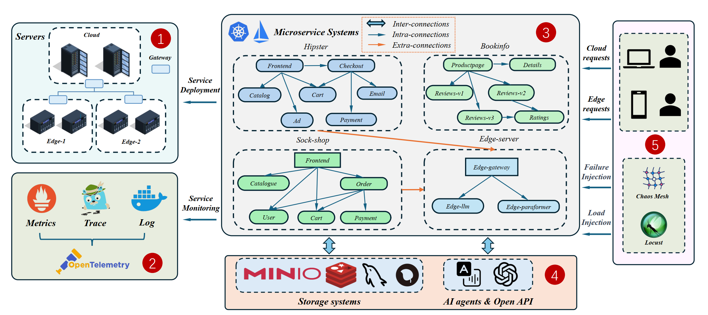

# HybridCloud
## Description

The project contains the configuration files of a benchmark of hybrid-deployed microservice systems in a cloud-edge collaborative environment.

The versions of the components in the cluster are as follows:

| Component | Version | 
|-------|-------|
| Kubernetes | v1.22.16 |
| Kuboard | v3.3.0 |
|Istio |v1.13.4|
|Jaeger |v1.52|
|Elasticsearch | v8.11.3|
|Tcpdump | v4.9.2|
|Nacos| v2.2.1|
|Etcd |v3.4.13|

## Architecture Graph

## Quick Start
### Presequisite

* Helm supported, you can see https://helm.sh/docs/helm/helm_install/ for helm install
* PVC supported, you can see https://openebs.io/docs/2.12.x/user-guides/installation for localPV support.

### 1. Build a Kubernetes Cluster
We can use *kubeadm* to quickly initialise a cluster.
```shell
sudo kubeadm init --pod-network-cidr=10.244.0.0/16
                  --apiserver-advertise-address=[Master Node IP]
                  --upload-certs
                  --apiserver-cert-extra-sans=[Master Node IP]
                  --service-cidr=10.96.0.0/12
                  --image-repository registry.aliyuncs.com/google_containers
                  --kubernetes-version=v1.22.16
```
In order to add edge nodes to the cluster, we need to deploy the *OpenYurt* component.
```shell
helm repo add openyurt https://openyurtio.github.io/openyurt-helm

helm upgrade --install yurt-manager -n kube-system openyurt/yurt-manager

helm upgrade --install yurt-hub -n kube-system --set kubernetesServerAddr=https://1.2.3.4:6443 openyurt/yurthub

helm upgrade --install raven-agent -n kube-system openyurt/raven-agent
```
It is also acceptable to choose your own deployment plan based on the [OpenYurt document](https://openyurt.io/docs/installation).
### 2. Deploy Monitor Tools

```bash
make monitor-deploy
```
Note: 
* If you want to use Istio, you can follow the [Istio document](https://istio.io/latest/docs/setup/install/).
* If you want to load test the microservice systems in the cluster, we recommend Locust as a load generation tool. You can follow the [Locust document](https://docs.locust.io/en/stable/installation.html) or [Data Operation](#Data-Operation) for further details.
### 3. Deploy Microservice Systems
```bash
make service-deploy
```
Note:
* If you want to use Nacos, you can follow the [Nacos document](https://nacos.io/docs/latest/quickstart/quick-start/).
* If you want to use Minio, you can follow the [Minio document](https://min.io/docs/minio/kubernetes/upstream/index.html).
## Data Operation
The data operation of this cluster consists of three parts, which you can see in detail in the following links:
* [Fault injection](https://github.com/WDCloudEdge/Failure-injection.git) :By using choas-mesh, we simulated various types of failures in the cluster, including CPU, memory, network and container failures.
* [Load Generation](https://github.com/WDCloudEdge/load-generator.git): In order to simulate access to microservice systems by different numbers of users, we used Locust to generate loads.
* [Data Collection](https://github.com/WDCloudEdge/data-collector.git): With the help of monitoring tools, we collect metrics data on multiple dimensions for each microservice system.

## Instruction 
In order to ensure that clusters work better, we have made adjustments in the following three parts:
### 1. ELK
For better persistence, we chose to store the data collected by Jaeger in [Elasticsearch](https://www.elastic.co/cn/elasticsearch) and [Kibana](https://www.elastic.co/cn/kibana)
### 2. Etcd Cluster
The default etcd in Kubernetes has limited carrying capacity, and we chose to upgrade it to cluster mode: [Etcd Cluster](https://etcd.io/docs/v3.5/op-guide/clustering/)
### 3. Nfs
Across the cluster, we use nfs as the default presentation layer protocol.

## License
This project is licensed under the Apache 2.0 License - see the [LICENSE](https://github.com/WDCloudEdge/HybridCloudConfig/LICENSE) file for details. Certain images in HybridCloud rely on the existing code from [Sock Shop](https://github.com/microservices-demo/microservices-demo.git) ,[Hipster](https://github.com/WDCloudEdge/Augmented-OnlineBoutique.git) ,[Train Tickets](https://github.com/WDCloudEdge/train-ticket.git). The credits go to the original authors